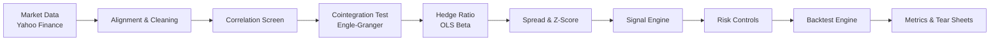

# Statistical Arbitrage Trading Engine

<p align="center">
  <strong>Research-grade pairs trading system</strong> that discovers cointegrated pairs, trades mean reversion, and stress-tests results with realistic backtests.
</p>

<p align="center">
  <a href="https://www.python.org/downloads/"></a>
  <a href="LICENSE"></a>
  
  
  
</p>

<p align="center">
  🔍 Find pairs · 📉 Trade z-score signals · 🧠 Manage risk · 📊 Analyze performance
</p>

---

## ✨ What makes this project special

<table>
  <tr>
    <td><strong>End-to-end pipeline</strong><br/>Download → Screen → Cointegrate → Trade → Report</td>
    <td><strong>Realistic backtests</strong><br/>Slippage, commissions, and position sizing baked in</td>
    <td><strong>Signal clarity</strong><br/>Z-score mean-reversion with configurable thresholds</td>
  </tr>
  <tr>
    <td><strong>Risk discipline</strong><br/>Stop-loss, drawdown caps, volatility targeting</td>
    <td><strong>Transparent outputs</strong><br/>CSV reports + tear sheet visuals</td>
    <td><strong>Interview-ready</strong><br/>Clean architecture, talking points, and notebook</td>
  </tr>
</table>

---

## 🧭 Visual pipeline



---

## 🚀 Quick start

### 1) Install

```bash
pip install -r requirements.txt
```

### 2) Run the full demo

```bash
python scripts/run_complete_demo.py
```

### 3) What you get

- Ranked pair candidates in `results/ranked_pairs.csv`
- High-correlation pairs in `results/high_correlation_pairs.csv`
- Sensitivity analysis in `results/sensitivity_SPY_DIA.csv`
- Tear sheet image in `results/tear_sheet_SPY_DIA.png`

---

## 🧩 How it works (at a glance)

1. **Screen for correlation** to reduce the search space.
2. **Test for cointegration** (Engle-Granger + ADF).
3. **Estimate hedge ratio** with OLS beta.
4. **Trade the spread** using z-score thresholds.
5. **Apply risk limits** (stop-loss, drawdown caps).
6. **Backtest & report** with costs and analytics.

---

## 📦 Project structure

```
quant/
├── data/                       # Cached CSV price data
├── notebooks/
│   └── 01_data_eda.ipynb       # Exploratory data analysis
├── scripts/
│   ├── download_data.py        # Download sample universe
│   ├── test_pairs.py           # Test pair selection
│   └── run_complete_demo.py    # Full pipeline demo
├── src/
│   ├── data.py                 # Data download & caching
│   ├── pairs.py                # Pair selection algorithms
│   ├── strategy.py             # Trading signal generation
│   ├── backtest.py             # Backtesting engine
│   ├── risk.py                 # Risk management
│   ├── metrics.py              # Performance visualization
│   └── utils.py                # Helper functions
├── results/                    # Performance reports & plots
└── tests/                      # Unit tests (future)
```

---

## 🧪 Usage snapshot

```python
from src.data import DataDownloader
from src.pairs import find_pairs
from src.backtest import Backtester
from src.strategy import StrategyConfig
from src.risk import RiskConfig

prices = DataDownloader().align_data(["SPY", "DIA"], price_type="Close")
pairs = find_pairs(prices, correlation_threshold=0.85)

backtester = Backtester(
    prices=prices,
    symbol_1="SPY",
    symbol_2="DIA",
    beta=1.637,
    strategy_config=StrategyConfig(z_entry_threshold=2.0),
    risk_config=RiskConfig(total_capital=1_000_000.0),
)

results = backtester.run()
backtester.print_summary()
```

---

## ⚙️ Configuration cheat sheet

| Module | Key knobs | What it controls |
|---|---|---|
| Strategy | `z_entry_threshold`, `z_exit_threshold`, `lookback_window` | Signal sensitivity & holding logic |
| Risk | `max_position_pct`, `stop_loss_pct`, `max_drawdown_pct` | Capital allocation & loss limits |
| Backtest | `commission_pct`, `slippage_pct`, `fill_price` | Execution realism |

---

## 📈 Results gallery

### Tear sheet


### Parameter sensitivity (sample)

| z_entry | lookback | Total Return % | Sharpe Ratio | Max DD % | # Trades | Win Rate % |
|---------|----------|----------------|--------------|----------|----------|------------|
| 2.0     | 90       | +0.55          | 0.55         | -0.31    | 20       | 80.0       |
| 1.5     | 60       | +0.50          | 0.32         | -0.81    | 40       | 75.0       |
| 2.5     | 90       | +0.23          | 0.29         | -0.25    | 11       | 81.8       |
| 1.5     | 90       | +0.22          | 0.21         | -0.43    | 26       | 73.1       |

### Multi-pair portfolio (sample)

| Pair    | Total Return % | Sharpe | Max DD % | # Trades |
|---------|----------------|--------|----------|----------|
| SPY/DIA | -0.09          | -0.08  | -0.62    | 24       |
| WFC/MS  | +1.21          | 0.47   | -0.89    | 27       |
| WFC/SPY | +3.18          | 0.79   | -1.08    | 32       |

---

## 🧠 Key design choices

- **Cointegration first**: avoids chasing spurious correlations.
- **Dollar-neutral exposure**: reduces market beta.
- **Simple signals**: interpretable z-score logic beats black boxes for learning.
- **Realistic costs**: commissions + slippage to avoid inflated performance.

---

## 🛣️ Roadmap

### ✅ Completed

- Data pipeline + caching
- Pair selection + cointegration tests
- Z-score strategy + risk controls
- Backtesting + analytics
- Parameter sensitivity + tear sheets

### 🔮 Future enhancements

- Intraday data + execution simulator
- Walk-forward optimization
- Cross-sectional mean reversion
- Alternative signals (volatility, sentiment)
- Live trading API integration
- Monte Carlo robustness testing

---

## ⚠️ Limitations & risk notes

- Past performance does not guarantee future results.
- Cointegration can break in new regimes.
- Real execution can differ from simulated fills.
- Liquidity, borrow costs, and market impact are simplified.

**Educational project only — not financial advice.**

---

## 📚 References & methods

- Engle-Granger cointegration
- Augmented Dickey-Fuller stationarity test
- OLS regression for hedge ratio
- Mean-reversion spread modeling

---

## 🤝 Contributing

Feedback and suggestions welcome via issues and PRs.

---

## 📝 License

MIT License — see [LICENSE](LICENSE).

---

## 🚀 Next steps

1. Run the demo: `python scripts/run_complete_demo.py`
2. Explore the notebook: `notebooks/01_data_eda.ipynb`
3. Try custom pairs: edit tickers in `scripts/test_pairs.py`
4. Tune parameters: adjust thresholds in `src/strategy.py`

---

Built for learning, demos, and interviews. Not financial advice.

For questions: [GitHub Issues](https://github.com/yxshee/StatArb/issues)
